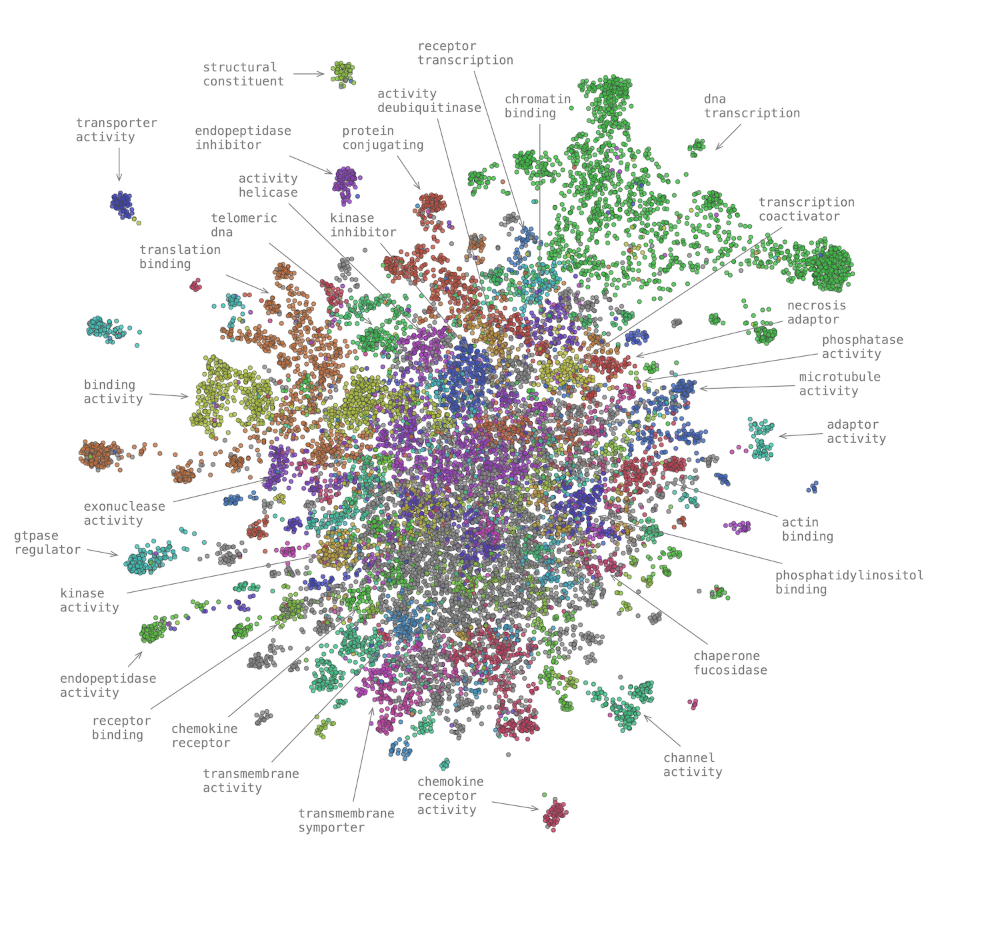

# Network Enrichment Analysis - Functional Landscapes

  
  

Protein-Protein Interaction Network Analysis

This project explores functional and disease associations in a protein-protein interaction (PPI) network.
By combining known annotations with terms inferred from network neighborhood enrichment, we build a richer disease profile for each protein.

Using a Random Walk with Restart model, we identify each protein’s local network neighborhood and test it for (dys-)functional term enrichment via the hypergeometric test. Significant terms are merged with existing annotations to create a comprehensive set of functinal or disease associations.

These enriched annotations are converted into a feature matrix, reduced with UMAP for visualization, and clustered using linkage clustering with cosine similarity. The result is an interpretable, data-driven map of functional relationships between proteins.